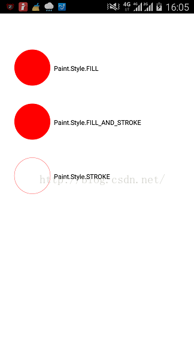
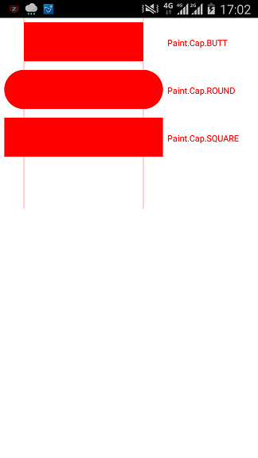
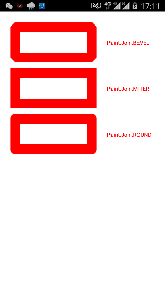

###View的绘制机制
>掌握onMeasure,onLayout,onDraw及相关类的使用。
####1.View的绘制流程
####2.相关类的使用，主要是在onDraw()方法里，Paint、Canvas、Matrix等类的使用。

1.Paint的style
  Paint.Style.FILL：填充内部
  Paint.Style.FILL_AND_STROKE：填充内部和描边
  Paint.Style.STROKE：描边
  
2.Paint的Cap
  主要是线条的末端，两条竖线是线条的起始点和终点。
  
3.Paint的Join
连接时候使用
  
